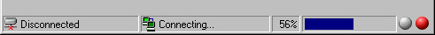



## Cool StatusBar \- Look at the Screenshot\!

### Description

The StatusBar, a boring control?

This code shows you how to get effects like in Internet Explorer!

Included features:

-Animated icons in the StatusBar

-ProgressBar in the StatusBar

-Ready/Working display exactly like in WinZip

Have fun and vote for me!
 
### More Info
 

             |
---                |---
**Submitted On**   |2000-09-05 23:24:34
**By**             |[Druid Developing](https://github.com/Planet-Source-Code/PSCIndex/blob/master/ByAuthor/druid-developing.md)
**Level**          |Beginner
**User Rating**    |4.6 (134 globes from 29 users)
**Compatibility**  |VB 6\.0
**Category**       |[Custom Controls/ Forms/  Menus](https://github.com/Planet-Source-Code/PSCIndex/blob/master/ByCategory/custom-controls-forms-menus__1-4.md)
**World**          |[Visual Basic](https://github.com/Planet-Source-Code/PSCIndex/blob/master/ByWorld/visual-basic.md)
**Archive File**   |[CODE\_UPLOAD9652952000\.zip](https://github.com/Planet-Source-Code/druid-developing-cool-statusbar-look-at-the-screenshot__1-11280/archive/master.zip)

### API Declarations

None!!!

